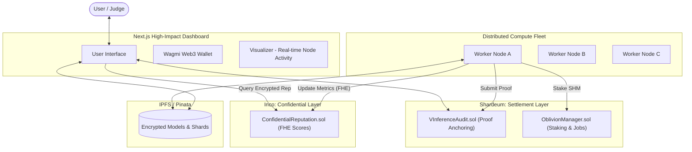

# 🧠 V-OBLIVION: AN AIRBNB FOR AI TRAINING

<div align="center">

**A Cross-Chain Ecosystem for Private, Verifiable, and Distributed Machine Learning**
**UTILIZING THE WASTED GPU RESOURCES IN GAMING PC's AND UNIVERSITY LABS AND MAKING A DECENTRALIZED NETWORK OF SUPERCOMPUTING INFRASTRUCTURE**

[](https://shardeum.org/)
[](https://www.inco.org/)
[]()
[]()

</div>

---

## 🌟 Overview

**V-OBLIVION** is a next-generation decentralized AI infrastructure. It solves the "Trust Gap" in AI by ensuring that every inference is cryptographically proven (ZKML) and every training shard is processed with mathematical privacy (Differential Privacy), all orchestrated via a high-performance dual-chain architecture.

- **🤖 Verifiable Inference (ZKML)**: Prove that the model you requested actually ran the data you provided.
- **🏋️ Sharded Training Mesh**: Distribute huge ML jobs across thousands of nodes with automatic reward distribution.
- **🛡️ Confidential Worker Stats (FHE)**: Use Inco's FHEVM to verify worker quality without exposing sensitive IP or personal performance data.
- **⛓️ Scalable Settlement (Shardeum)**: Settle thousands of concurrent proofs and transactions with Shardeum's linear scaling.

---
📸 Product Journey
<div align="center"> <h3>Step 1: Model Management</h3>  <p><i>Manage your decentralized AI models with ease.</i></p>

<br><br>

<h3>Step 2: Real-time Sharded Inference</h3>  <p><i>Watch the mesh shard and process your job with cryptographic proof.</i></p>

<br><br>

<h3>Step 3: AI Marketplace</h3>  <p><i>Monetize your models or buy compute power securely.</i></p>

<br><br>

<h3>Step 4: Verifiable History</h3>  <p><i>Every single job is anchored on Shardeum for immutable auditing.</i></p> </div>


## 🏗️ Technical Architecture

V-OBLIVION utilizes a hybrid architecture where **Shardeum** handles the high-throughput execution/settlement and **Inco** handles the confidential governance/reputation.



---

## ⛓️ Dual-Chain Contract Registry

- **Shardeum** - `VInferenceAudit` (`0xb3BD0a70eB7eAe91E6F23564d897C8098574e892`) - Immutable Proof Anchoring & Public Verification
- **Shardeum** - `OblivionManager` (`0x7991295433Ea07821F51f106B64754168b99a3f1`) - Decentralized Job Lifecycle & $SHM Staking
- **Inco** - `IncoReputation` (`0x7F26C92f3E792c92F3E792c92F3E792c92F3E792`) - Confidential Worker Reputation Tracking via FHEVM
- **Inco** - `PrivacyGateway` (`0x3E792c92F3E792c92F3E792c92F3E792c92F3E79`) - Encrypted Worker Selection & Governance Privacy

---

## 🚀 Sharded Inference Workflow

1.  **Request**: User selects a model and submits inputs via the Next.js dashboard.
2.  **Sharding**: The orchestrator breaks the task into compute shards for the mesh.
3.  **Encrypted Check**: The system queries **Inco** to find the most reputable available nodes.
4.  **Claim**: Workers on the mesh claim shards and stake $SHM on **Shardeum**.
5.  **Compute & Prove**: Nodes run the model and generate a **ZK-SNARK proof** using EZKL.
6.  **Anchoring**: The proof hash is sent to Shardeum's `VInferenceAudit` contract.
7.  **Verification**: The frontend validates the proof against the on-chain anchor, ensuring 100% integrity.

---

## 📁 Project Structure

### 🗄️ Root Hierarchy
```bash
V-OBLIVION/
├── backend/               # FastAPI Microservice & Orchestration
├── frontend/              # Next.js 15 Web Application
├── worker/                # Decentralized Compute Node
├── contracts/             # Solidity Smart Contracts (Shardeum & Inco)
├── deploy/                # Shell & Python deployment scripts
└── storage/               # Shared artifacts & model weights
```

### 🐍 Backend Structure (`/backend`)
```bash
backend/app/
├── api/                   # REST API Layer
│   ├── inference.py       # ZKML execution & job sharding
│   ├── marketplace.py     # Escrow & model listing logic
│   ├── training.py        # ML training job management
│   ├── workers.py         # Node registration & heartbeat
│   └── users.py           # Wallet-based user profiles
├── core/                  # System Backbone
│   ├── blockchain.py      # Web3/Shardeum provider
│   ├── database.py        # JSON Data Proxy (Persistence)
│   ├── demo_data.py       # Hackathon seed data logic
│   └── config.py          # Dual-chain ENV configuration
├── services/              # Specialized Heavy-Lift Logic
│   ├── ezkl_service.py    # Direct EZKL ZK-SNARK integration
│   ├── zkml_simulator.py  # ZKML Orchestration & local verification
│   └── ipfs_service.py    # Pinata/IPFS storage adapter
└── storage/               # JSON Flat-file database storage
```

### ⚛️ Frontend Structure (`/frontend`)
```bash
frontend/src/
├── app/                   # Next.js App Router (Pages)
│   ├── dashboard/         # User Portal
│   │   ├── inference/     # Model Sandbox & ZKML runner
│   │   ├── marketplace/   # AI Marketplace UI
│   │   ├── workers/       # Node Monitoring & Fleet status
│   │   └── training/      # ML Shard Progress view
│   ├── visualizer/        # Real-time Mesh Track (Judge Demo)
│   └── worker-hub/        # Node Operator Control Panel
├── components/            # Reusable UI Architecture
│   ├── ProofVerifier.tsx  # Interactive SNARK verifier
│   ├── JobCard.tsx        # Dynamic job status card
│   └── VisualizerComponents.tsx # Animated mesh nodes
└── lib/                   # Middleware & Hooks
    ├── api.ts             # Backend Integration Client
    ├── wagmi.ts           # Shardeum/Wallet Config
    └── incoService.ts     # Inco FHEVM interaction layer
```

### ⚙️ Worker Structure (`/worker`)
```bash
worker/
├── decentralized_worker.py # Main Worker Life-cycle
├── blockchain_client.py    # Multi-chain (Shardeum/Inco) Logic
├── zk_proofs.py           # EZKL Proof Generation (SNARKs)
├── privacy.py             # Differential Privacy (Laplace)
├── quality_verification.py # FHE-based encrypted metrics
└── ipfs_client.py         # Shard & Model storage
```

---

## 🛠️ Key Technical Features

- **EZKL Integration**: Real-world ZK-SNARK generation for Scikit-Learn and ONNX models.
- **Differential Privacy**: Built-in ε-differential privacy mechanisms for decentralized training shards.
- **Live Mesh Visualizer**: A dedicated dashboard to witness the "Worker Boxes" turn green as they complete verifiable tasks.
- **SSH Tunneling**: Workers can operate behind NATs/Firewalls while remaining globally accessible for remote management.

---

## 💡 The Value Proposition

V-OBLIVION (Verifiable Oblivion) transforms idle global compute into a private, verifiable, and unified AI powerhouse.

- **Computational Integrity**: Every inference is paired with a **ZK-SNARK proof** (EZKL), providing a mathematical guarantee that the model was run correctly.
- **Data Privacy**: Large-scale training is distributed across a mesh using **Differential Privacy** (Laplace), ensuring sensitive data never leaves its source unmasked.
- **Confidential Governance**: **Inco's FHEVM** processes worker reputation and selection in an encrypted state, preventing system gaming while protecting node operator privacy.

---

<div align="center">
**V-OBLIVION** - Empowering the future of Verifiable, Private, and Distributed AI.
</div>
