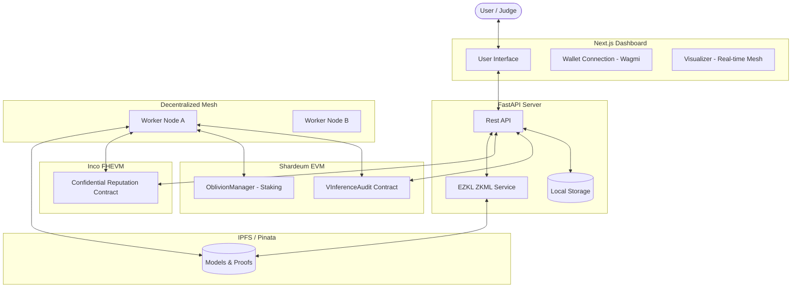

# 🧠 V-OBLIVION: Decentralized AI Inference & ML Training Platform

**Verifiable AI Inference + Sharded ML Training Marketplace on Shardeum & Inco**

---

## 🌟 Overview

**V-OBLIVION** is a decentralized ecosystem for verifiable AI, built on a cross-chain architecture leveraging **Shardeum** for high-speed job orchestration and **Inco (FHEVM)** for privacy-preserving reputation management.

- **🤖 Verifiable Inference**: Run AI models (Scikit-Learn, ONNX, Transformers) with cryptographic proof of correct execution.
- **🏋️ Sharded ML Training**: High-performance training jobs broken into shards and processed by a global compute fleet.
- **�️ Confidential Reputation (Inco)**: Worker performance and reputation are managed via Fully Homomorphic Encryption (FHE) on Inco, ensuring worker privacy while maintaining network quality.
- **⛓️ Proof Anchoring (Shardeum)**: All ZKML proofs are anchored to Shardeum for immutable, low-cost auditing.

---

## 🏗️ Architecture

---

## 🔄 Dual-Chain Strategy

### 1. Shardeum: The Execution Engine
- **Scalability**: Handles the high-frequency job submissions and worker heartbeat events.
- **Anchoring**: Stores the `bytes32` hashes of ZKML proofs in the `VInferenceAudit` contract.
- **Economy**: Manages $SHM rewards, staking, and escrowed marketplace payments.

### 2. Inco: The Privacy Layer
- **FHEVM Integration**: Uses Inco's Fully Homomorphic Encryption to store worker quality scores.
- **Confidential Selection**: Backend queries Inco to select workers based on encrypted reputation without revealing individual performance data to the entire mesh.
- **Privacy-First Quality**: `IncoReputation.sol` ensures that only authorized validators can update or view sensitive worker metrics.

---

## 📁 Detailed Project Structure

### 🗄️ Root Directory
- `backend/`: FastAPI Backend & Orchestration Layer
- `frontend/`: Next.js 15 Frontend (App Router)
- `worker/`: Decentralized Worker Node implementation
- `contracts/`: Solidity Smart Contracts for **Shardeum** and **Inco**.

### ⚙️ Worker Node (`/worker`)
- `blockchain_client.py`: Multi-chain client interacting with both Shardeum (EVM) and Inco (FHEVM).
- `zk_proofs.py`: EZKL integration for generating SNARK proofs of ML computation.
- `privacy.py`: Differential Privacy (Laplace mechanism) for training data.
- `quality_verification.py`: Computes encrypted metrics to be sent to Inco.

---

## 🔗 Smart Contract Registry

| Chain | Contract | Purpose | Address |
|-------|----------|---------|---------|
| **Shardeum** | `VInferenceAudit` | Proof Anchoring | `0xb3BD0a70eB7eAe91E6F23564d897C8098574e892` |
| **Shardeum** | `OblivionManager` | Staking & Job Lifecycle | `0x7991295433Ea07821F51f106B64754168b99a3f1` |
| **Inco** | `IncoReputation` | Confidential Worker Scores | `0x... (Deployed on FHEVM)` |

---

Built for Shardeum & Inco | Verifiable & Private AI

